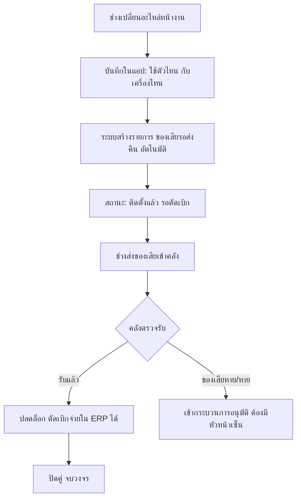
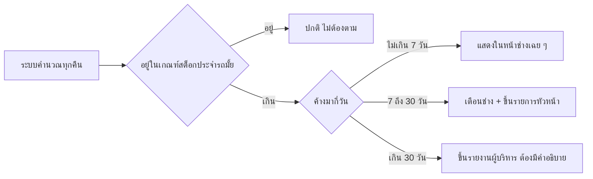

# ระบบติดตามอะไหล่ในมือช่าง — แบบร่างกระบวนการ

เอกสารออกแบบ ยังไม่ได้ลงมือแก้แอป ไว้ตกลงกันให้จบก่อนแล้วค่อยเขียนโค้ด

**แนวทางที่เลือกแล้ว:** ใช้กลไกโอนระหว่างคลังของ ERP โดยสร้างคลังในชื่อช่างแต่ละคน

> 📄 เอกสารนี้อธิบาย **เหตุผลเบื้องหลังการออกแบบ**
> ถ้าต้องการขั้นตอนการทำงานจริงพร้อมผังงาน ดูที่ [วิธีการทำงาน](./spare-part-workflow.md)

---

## 1. ปัญหาที่แท้จริง

ERP ทำงานถูกต้องแล้วในสิ่งที่มันรับผิดชอบ สิ่งที่ขาดคือ **หลังจากของออกจากคลังไปแล้ว
ไม่มีเหตุการณ์ไหนมาปิดวงจร** — พอไม่มี ก็ตอบไม่ได้ว่าของอยู่ไหน ใช้ไปแล้วยัง ควรคืนมั้ย

**วิธีที่เลือกแก้ตรงจุดนี้พอดี** เพราะทำให้ของที่ออกจากคลังหลักไม่ได้ "หายไปจากระบบ"
แต่ไป**ลงที่คลังของช่างคนนั้น** ซึ่ง ERP มองเห็นและรายงานได้ตลอดเวลา

---

## 2. แนวทางที่เลือก และทำไมมันถูกทาง

```
1. สร้างคลังในชื่อช่างขึ้นมาก่อน
2. เวลาช่างเอาอะไหล่ไป → โอนไปคลังช่างก่อน
3. เปลี่ยนอะไหล่หน้างาน → คืนของเสีย → ตัดเบิกจ่าย
   ถ้าไม่ได้ใช้ → โอนคืนคลังหลัก
```

**ข้อดีที่สำคัญที่สุด: มีบัญชีชุดเดียว**

ถ้าให้แอปเก็บยอดเองแยกจาก ERP สุดท้ายเลขสองที่จะไม่ตรงกัน แล้วคนจะเลิกเชื่อทั้งคู่
วิธีนี้ตัดปัญหานั้นทิ้งตั้งแต่ต้น — ยอดคงเหลือมีที่เดียวคือ ERP

ข้อดีอื่น

- ใช้เอกสารและกลไกที่ ERP มีอยู่แล้ว ไม่ต้องสร้างของใหม่มาแข่ง
- ต้นทุนและมูลค่าสต็อกยังถูกต้องตามระบบบัญชี
- ตรวจสอบย้อนหลังได้ด้วยเอกสารโอนที่มีอยู่จริง

**เพราะฉะนั้นหน้าที่ของแอปจึงเปลี่ยนไป** ไม่ใช่มาเก็บยอดแข่งกับ ERP แต่คือ

> ### ERP เก็บ "ยอด" — แอปเก็บ "สถานะ" และเป็นมือเป็นเท้าให้ช่างที่หน้างาน

---

## 3. ช่องว่างที่ ERP อย่างเดียวยังไม่ปิด

ต่อให้ทำครบ 3 ขั้นแล้ว ยังเหลือปัญหาเหล่านี้ ซึ่งเป็นที่มาของทุกอย่างในเอกสารนี้

| # | ช่องว่าง | ทำไม ERP ทำเองไม่ได้ |
|---|---|---|
| 1 | ช่างเปิดดูไม่ได้ว่าตัวเองถือของอะไรอยู่ | ช่างไม่มีสิทธิ์เข้า ERP และ ERP ใช้บนมือถือหน้างานไม่ไหว |
| 2 | ทุกการโอนต้องมีคนนั่งคีย์ที่ออฟฟิศ | คนที่รู้ว่าเกิดอะไรขึ้นคือช่างที่หน้างาน ไม่ใช่คนคีย์ |
| 3 | ไม่มีใครคุมว่าของเสียถูกส่งคืนจริง | ERP ไม่รู้จักความสัมพันธ์ "ของใหม่ตัวนี้ คู่กับของเสียตัวนั้น" |
| 4 | ไม่รู้ว่าอะไหล่ตัวนี้เปลี่ยนให้เครื่องไหน สาขาไหน งานไหน | ERP มี cost center แต่ช่างไม่ได้กรอก และไม่ได้ผูกกับตัวเครื่อง |
| 5 | ไม่รู้ว่าของค้างในคลังช่างมานานแค่ไหน | รายงานสต็อกบอกยอด ณ ตอนนี้ ไม่ได้บอกอายุ |
| 6 | ของในรถกับยอดใน ERP เพี้ยนกันตามเวลา | ต้องนับจริง ซึ่งต้องนับที่รถ ไม่ใช่ที่ออฟฟิศ |
| 7 | แยกไม่ออกว่าของติดรถที่ควรมี กับของที่ลืมคืน | เป็นนโยบายการจัดการ ไม่ใช่ข้อมูลบัญชี |

---

## 4. เรื่องที่ต้องตัดสินใจก่อนอื่น: จะตัดเบิกจ่ายตอนไหน

ขั้นที่ 3 ที่พี่เขียนว่า *"หลังจากคืนอะไหล่เสีย ถึงตัดเบิกจ่ายอะไหล่"* มีผลข้างเคียงที่ต้องรู้ก่อน

ถ้ารอของเสียกลับมาก่อนค่อยตัดเบิก จะเกิดช่วงเวลาที่

- ของใหม่ **ติดตั้งอยู่ในเครื่องลูกค้าแล้ว**
- แต่ ERP ยังแสดงว่าของอยู่ใน **คลังช่าง**
- ถ้าของเสียกลับมาช้า 2 สัปดาห์ → ERP ผิดจากความจริง 2 สัปดาห์

มีสองทางเลือก ทั้งคู่ใช้ได้ แต่ต้องเลือกให้ชัดแล้วทำให้เหมือนกันทั้งบริษัท

| | **ทาง ก. ตัดเบิกตอนติดตั้ง** | **ทาง ข. ตัดเบิกหลังของเสียกลับ** (ที่พี่เขียน) |
|---|---|---|
| ยอด ERP | ตรงกับของจริงตลอด | ผิดชั่วคราวจนกว่าของเสียจะกลับ |
| การคุมของเสีย | ต้องมีตัวติดตามแยก | บังคับในตัว ไม่คืนก็ไม่ตัด |
| งานเคลม/รับประกัน | ต้องผูกทีหลัง | ชัดเจนกว่า รู้ก่อนว่าเคลมได้มั้ยค่อยลงบัญชี |
| ความเสี่ยง | ของเสียหายไปเงียบ ๆ ถ้าไม่มีคนตาม | ตัวเลขสต็อกเชื่อไม่ได้ระหว่างรอ |

**ถ้าเหตุผลที่รอของเสียคือเรื่องเคลมประกัน — ทาง ข. ถูกแล้วครับ** อย่าเปลี่ยน
แต่ต้องให้แอปแสดงสถานะ **"ติดตั้งแล้ว รอตัดเบิก"** ให้ชัด ไม่งั้นคนอ่านรายงาน ERP
จะเข้าใจผิดว่าของยังอยู่ในรถช่าง

ถ้าเป็นอะไหล่ที่ไม่เกี่ยวกับการเคลม แนะนำใช้ทาง ก. เพื่อให้ ERP ตรงกับของจริง
— **ใช้คนละแบบตามประเภทอะไหล่ได้** ตราบใดที่กติกาชัด

---

## 5. สถานะที่แอปต้องเก็บ (เพราะ ERP ไม่มี)

ERP รู้แค่ 2 อย่าง: ของอยู่คลัง A หรือคลัง B แต่ความจริงหน้างานมีมากกว่านั้น

| สถานะในแอป | ERP เห็นเป็นอะไร | ใครรับผิดชอบ |
|---|---|---|
| อยู่ในรถ ยังไม่ได้ใช้ | คลังช่าง | ช่าง |
| ติดตั้งแล้ว รอคืนของเสีย รอตัดเบิก | **ยังเป็นคลังช่าง** ⚠ | ช่าง |
| ของเสียรอส่งคืน | ไม่เห็นเลย | ช่าง |
| ช่างส่งคืนแล้ว คลังยังไม่รับ | ยังเป็นคลังช่าง | ช่าง จนกว่าคลังจะรับ |
| คลังรับคืนแล้ว | คลังหลัก | คลัง |
| สูญหาย/เสียหาย รออนุมัติ | ยังเป็นคลังช่าง | ช่าง + หัวหน้า |

แถวที่มี ⚠ คือแถวที่อันตรายที่สุด เพราะ ERP บอกอย่างหนึ่งแต่ความจริงเป็นอีกอย่าง
**ทั้งระบบที่จะสร้างมีอยู่เพื่อให้แถวนี้ไม่หายไปในความมืด**

---

## 6. ระบบที่ต้องมี support — เรียงตามลำดับความสำคัญ

### 🥇 A. หน้า "ของในมือฉัน" (ช่างเปิดดูเอง)

ช่างเห็นรายการอะไหล่ในคลังตัวเองบนมือถือ พร้อมอายุว่าถือมากี่วันแล้ว

| | |
|---|---|
| **แก้ช่องว่างข้อ** | 1, 5 |
| **ทำไมสำคัญที่สุด** | รายงานที่หัวหน้าเปิดเดือนละครั้งไม่เปลี่ยนพฤติกรรมใคร แต่ตัวเลขที่ช่างเห็นทุกวันเปลี่ยนได้ |
| **ข้อมูลมาจากไหน** | ยอดตั้งต้นจากเอกสารโอนที่คีย์เข้าแอป + กระทบยอดกับรายงาน ERP เดือนละครั้ง |

### 🥇 B. ใบขอโอนจากหน้างาน (ต่อยอดของที่ทำไว้แล้ว)

ช่างกดขอโอน/ขอคืนจากมือถือ → ได้เอกสาร → คนคลังคีย์เข้า ERP ตามนั้น

| | |
|---|---|
| **แก้ช่องว่างข้อ** | 2 |
| **สถานะ** | **มีอยู่แล้ว** — หน้าเอกสารขอโอนสินค้าที่เพิ่งทำเสร็จ ใช้ได้เลย ต่อยอดแค่ให้เลือกคลังช่างเป็นปลายทาง/ต้นทาง |
| **สำคัญตรงไหน** | ถ้าช่างขอโอนคืนจากหน้างานไม่ได้ ของจะไม่มีวันถูกคืน เพราะต้องรอกลับออฟฟิศซึ่งไม่เคยว่าง |

### 🥇 C. ตัวติดตามของเสียที่ต้องส่งคืน

ผูกคู่ **"อะไหล่ใหม่ที่ติดตั้ง" ↔ "ของเสียที่ต้องได้คืน"** แล้วตามจนกว่าจะปิดคู่



| | |
|---|---|
| **แก้ช่องว่างข้อ** | 3 |
| **ทำไมต้องมี** | ขั้นที่ 3 ของพี่ทั้งขั้นตั้งอยู่บนเงื่อนไขนี้ ถ้าไม่มีใครคุม ของเสียจะไม่กลับ แล้วการตัดเบิกจะค้างไปเรื่อย ๆ |
| **ตัวเลขที่ต้องเห็น** | ของเสียค้างส่งคืนกี่คู่ อายุเท่าไหร่ แยกตามช่าง |

### 🥈 D. ผูกอะไหล่กับงาน / เครื่อง / สาขา

ตอนช่างปิดงานในแอป ให้เลือกอะไหล่ที่เปลี่ยน จากรายการของในมือตัวเอง

| | |
|---|---|
| **แก้ช่องว่างข้อ** | 4 |
| **ต่อยอดจาก** | หน้าบันทึกการทำงานที่มีอยู่แล้ว ช่างไม่ต้องเรียนหน้าจอใหม่ |
| **ได้อะไรเพิ่ม** | ประวัติอะไหล่รายเครื่อง — ต่อไปจะรู้ว่าเครื่องไหนกินอะไหล่ผิดปกติ สาขาไหนซ่อมบ่อย ซึ่ง ERP ไม่มีวันตอบได้ |
| **กติกา** | ปิดงานไม่ได้ถ้าไม่ตอบ แต่ต้องมีปุ่ม "ไม่ได้ใช้อะไหล่" กดง่าย ๆ ไม่งั้นช่างจะเลิกบันทึกงาน |

### 🥈 E. รายงานอายุของค้าง + แจ้งเตือน



| | |
|---|---|
| **แก้ช่องว่างข้อ** | 5, 7 |
| **หัวใจ** | นับอายุจาก **วันที่โอนเข้าคลังช่าง** ซึ่ง ERP มีอยู่แล้วในเอกสารโอน |

### 🥈 F. สต็อกประจำรถ (par level) ⭐

กำหนดรายการอะไหล่ที่อนุญาตให้ช่างเก็บติดรถถาวร พร้อมจำนวนสูงสุดต่อคน

| อะไหล่ | ให้ติดรถได้ |
|---|---|
| วาล์วน้ำ 4 ทาง Oasis | 2 ตัว |
| ELECTRODE, SPARK PKG | 3 ตัว |
| คอยล์มิเตอร์ตัวรับเหรียญ | 1 ตัว |

**เหตุผลที่ต้องมี — ข้อนี้สำคัญกว่าที่ดู**

ความจริงคือช่างเบิกเผื่อเพราะการเบิกมันช้า ไปงานแล้วไม่มีของต้องกลับมาเบิกใหม่ เสียทั้งวัน
การเบิกเผื่อจึงเป็นพฤติกรรมที่สมเหตุสมผลของเขา

ถ้าออกแบบให้ "ของค้าง = ความผิด" ทั้งหมด ผลที่ได้จะไม่ใช่ช่างคืนของ แต่จะเป็น
**ช่างซ่อนของ** แล้วเราจะยิ่งมองไม่เห็นกว่าเดิม

พอมี par level ระบบจะไล่ตามเฉพาะส่วนที่เกินเกณฑ์ ช่างรู้สึกว่าเป็นธรรม และให้ความร่วมมือ

### 🥉 G. นับสต็อกรถ (เดือนละครั้ง)

ช่างเปิดรายการของในมือ → นับจริง → กรอกยอดที่นับได้ → ส่วนต่างออกเป็นเอกสารปรับปรุงยอดให้ ERP
หัวหน้าอนุมัติก่อนคีย์

| | |
|---|---|
| **แก้ช่องว่างข้อ** | 6 |
| **ทำไมขาดไม่ได้** | ต่อให้ออกแบบดีแค่ไหน ยอดจะเพี้ยนตามเวลาเสมอ ต้องมีจังหวะรีเซ็ตความจริง |
| **ห้ามเด็ดขาด** | ห้ามให้ช่างปรับยอดเองโดยไม่มีคนอนุมัติ ไม่งั้นทุกปัญหาจะถูกกลบด้วยการปรับยอด |

### 🥉 H. ส่งต่อระหว่างช่าง

เกิดขึ้นจริงตลอดเวลา — *"พี่มีวาล์วมั้ย ขอตัวนึง"* ถ้าระบบไม่รองรับ คนจะทำนอกระบบแล้วยอดเพี้ยน

ใน ERP คือการโอนคลังช่าง ก. → คลังช่าง ข. ในแอปต้องให้**สองฝ่ายกดยืนยัน** แล้วออกเอกสารให้คลังคีย์

---

## 7. กติกาที่ต้องตกลงกับฝ่าย ERP และคลัง (ไม่ใช่เรื่องโปรแกรม)

ข้อพวกนี้ไม่ต้องเขียนโค้ด แต่ถ้าไม่ตกลงให้จบก่อน ระบบจะพังไม่ว่าโปรแกรมจะดีแค่ไหน

| เรื่อง | ต้องตกลงว่า |
|---|---|
| **ชื่อคลังช่าง** | ตั้งชื่อแบบไหนให้เป็นระบบ เช่น `VAN-สศิน` หรือ `คลังช่าง-EMP001` — ต้องหาเจอง่ายในรายงาน |
| **ใครคีย์โอนใน ERP** | ระบุตำแหน่งให้ชัด ถ้าไม่มีเจ้าภาพ เอกสารจะกองแล้วข้อมูลจะช้าเป็นสัปดาห์ |
| **รับของคืนภายในกี่นาที** | คนคลังต้องกดรับได้เร็ว ไม่งั้นเขาจะไม่กด แล้วยอดจะค้างที่ช่างทั้งที่ของถึงคลังแล้ว |
| **ช่างลาออก / ย้ายทีม** | ปิดคลังช่างได้ต่อเมื่อ **ยอดเป็นศูนย์** เท่านั้น ต้องเคลียร์ก่อนคืนรถ คืนบัตร |
| **ช่างเข้าใหม่** | ใครเปิดคลังให้ ใช้เวลากี่วัน ถ้าช้ากว่าวันเริ่มงาน ช่างจะไปเบิกในนามคนอื่นทันที |
| **ของค้าง → บล็อกการเบิกมั้ย** | **แนะนำไม่บล็อก** ให้แจ้งเตือนหัวหน้าแทน เพราะงานหน้าไซต์หยุดแพงกว่าอะไหล่ที่ค้างมาก |

---

## 8. ข้อมูลจะเข้าแอปยังไง — 3 ทางเลือก

แอปต้องรู้ยอดในคลังช่างเพื่อแสดงหน้า "ของในมือฉัน" คำถามคือรู้ได้ยังไง

| แนวทาง | ข้อดี | ข้อเสีย | เหมาะเมื่อ |
|---|---|---|---|
| **ก. คีย์เอกสารโอนเข้าแอปด้วย** (แนะนำเริ่มที่นี่) | เริ่มได้เลย ไม่ต้องพึ่งใคร | คนคลังคีย์เพิ่มจุดละ ~30 วินาที และมีโอกาสเพี้ยนจาก ERP | ยังไม่รู้ว่า ERP เปิด API ได้มั้ย |
| **ข. Export รายงานสต็อกจาก ERP มา import** | ลดงานคี้ ตรงกับ ERP แน่นอน | ข้อมูลช้าเป็นวัน | ERP export CSV ได้ |
| **ค. เชื่อม API** | ตรงกันทันที ไม่มีงานคีย์ | ต้องพึ่งทีม ERP อาจมีค่าใช้จ่าย | ERP มี API และมีคนดูแล |

**คำแนะนำ:** เริ่มที่ **ก.** แล้ว**บังคับกระทบยอดกับรายงานสต็อก ERP เดือนละครั้ง**
ถ้าเพี้ยนจะได้รู้ทันที ไม่ปล่อยให้สะสม พอกระบวนการนิ่งแล้ว 2-3 เดือนค่อยขยับไป ข. หรือ ค.

> ถ้าไปเชื่อม API ตั้งแต่แรกโดยที่กระบวนการยังไม่นิ่ง จะได้ระบบที่เชื่อมกันแน่นแต่ทำงานผิด

---

## 9. แผนทำเป็นเฟส

### เฟส 1 — ปิดวงจรให้ได้ก่อน

เป้าหมายเดียว: **ตอบให้ได้ว่าตอนนี้ของอยู่กับใคร มานานแค่ไหน**

- ทะเบียนคลังช่าง (ผูกกับ user ที่มีอยู่แล้ว)
- บันทึกเอกสารโอนเข้า/ออกคลังช่าง
- หน้า "ของในมือฉัน" พร้อมอายุ
- ต่อยอดหน้าเอกสารขอโอนให้เลือกคลังช่างได้
- รายงานของค้างรายช่าง

### เฟส 2 — คุมของเสียและผูกกับงาน

- ตัวติดตามของเสียที่ต้องส่งคืน + สถานะ "ติดตั้งแล้ว รอตัดเบิก"
- ผูกอะไหล่กับงาน/เครื่อง/สาขา ตอนปิดงาน
- แจ้งเตือนตามอายุของค้าง
- รับคืน 2 ขั้น (ช่างส่ง → คลังรับ)

### เฟส 3 — ทำให้เป็นธรรมและอยู่ได้ยาว

- สต็อกประจำรถ (par level)
- นับสต็อกรถ + อนุมัติปรับปรุงยอด
- ส่งต่อระหว่างช่าง
- สแกน QR แทนพิมพ์รหัส / เชื่อม ERP อัตโนมัติ

---

## 10. คำถามที่ยังต้องการคำตอบ

| # | คำถาม | ทำไมต้องรู้ |
|---|---|---|
| 1 | ERP ที่ใช้คือตัวไหน export CSV หรือมี API มั้ย | ตัดสินว่าเริ่มที่แนวทาง ก. ข. หรือ ค. |
| 2 | ERP ให้สร้างคลังได้ไม่จำกัดมั้ย มีค่าใช้จ่ายต่อคลังมั้ย | ถ้าจำกัด อาจต้องทำคลังตามทีมแทนรายคน |
| 3 | คลังช่างผูกกับ **คน** หรือ **คันรถ** | ถ้าช่างสลับรถกันบ่อย ผูกกับคนถูกกว่า |
| 4 | อะไหล่ประเภทไหนบ้างที่ต้องคืนของเสีย | กำหนดขอบเขตของเฟส 2 |
| 5 | ใครกดรับของคืนที่คลัง | ถ้าไม่มีเจ้าภาพ วงจรจะไม่มีวันปิด |
| 6 | มีอะไหล่ที่ต้องตาม serial รายชิ้นมั้ย | ถ้ามี ต้องออกแบบเพิ่มอีกชั้น |
| 7 | ช่างกี่คน อะไหล่หมุนเวียนกี่รายการต่อเดือน | ประเมินว่าคีย์มือไหวมั้ย |

---

## 11. สิ่งที่ระบบนี้จะ**ไม่**ทำ

เขียนไว้กันเข้าใจผิด

- **ไม่แทน ERP** — ยอดคงเหลือ การสั่งซื้อ ต้นทุน อยู่ที่ ERP ทั้งหมด แอปไม่เคยเป็นเจ้าของตัวเลข
- **ไม่ทำบัญชีต้นทุน** — ระบบนี้ตอบว่าของอยู่ไหน ไม่ได้ตอบว่าต้นทุนงานเท่าไหร่
- **ไม่บังคับให้ช่างคืนของทุกชิ้น** — ของที่อยู่ในเกณฑ์สต็อกประจำรถถือว่าปกติ
- **ไม่แก้ปัญหาการเบิกช้า** — ถ้าต้นเหตุที่ช่างเบิกเผื่อคือคลังจ่ายช้า ต้องแก้ที่นั่นด้วย
  ระบบนี้ทำได้แค่ทำให้เห็นว่าปัญหาอยู่ตรงไหน
