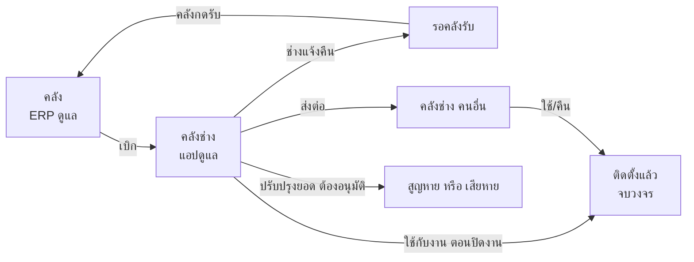
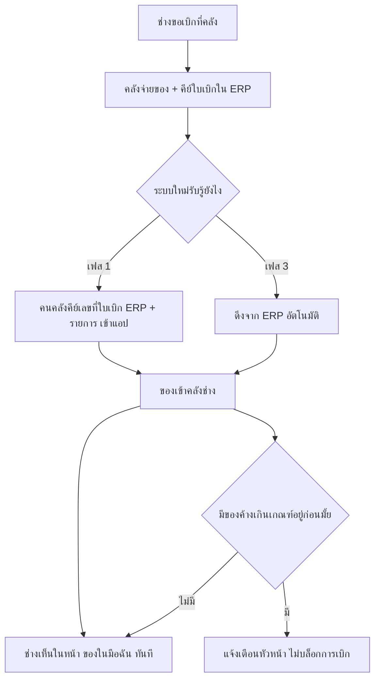
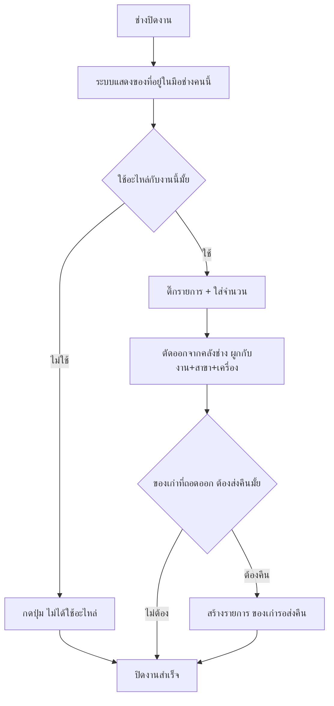
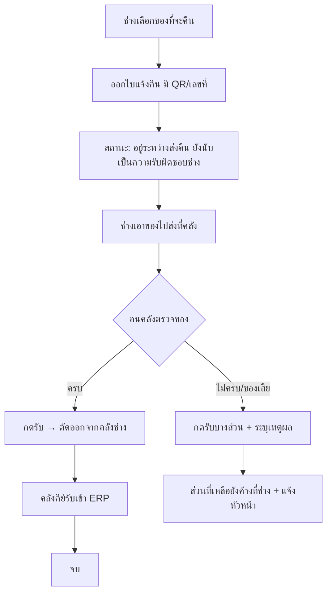
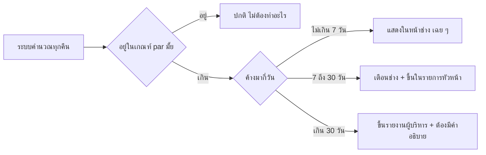

# ระบบติดตามอะไหล่ในมือช่าง — แบบร่างกระบวนการ

เอกสารออกแบบ ยังไม่ได้ลงมือแก้แอป ไว้ตกลงกันให้จบก่อนแล้วค่อยเขียนโค้ด

---

## 1. ปัญหาที่แท้จริง

ERP ทำงานถูกต้องแล้วในสิ่งที่มันรับผิดชอบ — ตัดจ่ายออกจากคลัง และโอนระหว่างคลัง
สิ่งที่ขาดคือ **หลังจากของออกจากคลังไปแล้ว ไม่มีเหตุการณ์ไหนมาปิดวงจร**

```
ERP รู้แค่นี้                        ตรงนี้มืดสนิท
─────────────────────────────  ┃  ──────────────────────────────────
คลัง → เบิกจ่ายให้ช่าง ก.       ┃  ??? อยู่ไหน ใช้ไปแล้วยัง ควรคืนมั้ย
                               ┃
                               ┗━ ไม่มีใครตอบได้จนกว่าจะไปถามช่าง
```

พอไม่มีเหตุการณ์ปิดวงจร ผลที่ตามมาคือ

| อาการ | สาเหตุจริง |
|---|---|
| เบิกไปแล้วไม่คืน ตามยาก | ไม่มีที่ไหนบอกว่า "ตอนนี้ของอยู่กับใคร เท่าไหร่" |
| เบิกไปแล้วไม่ได้ใช้ ไม่มีระบบรองรับ | ไม่มีสถานะ "ยังไม่ได้ใช้ ติดรถอยู่" มีแต่ใช้แล้วกับยังไม่เบิก |
| ต้องไล่ถามเป็นรายคน | ยอดคงค้างไม่ได้ถูกคำนวณ ต้องนั่งไล่เอกสารเบิกย้อนหลัง |
| ตัวเลขไม่น่าเชื่อถือ | ช่างบอกว่าคืนแล้ว คลังบอกไม่ได้รับ ไม่มีหลักฐานฝั่งไหน |

**ข้อสรุป:** ไม่ต้องสร้างระบบคลังใหม่มาแข่งกับ ERP ต้องสร้าง **ชั้นติดตามความรับผิดชอบ (custody layer)**
มาต่อท้าย ERP ตรงจุดที่มันจบ

---

## 2. หลักคิด 5 ข้อ

### 2.1 ของที่ออกจากคลังต้องไป "ลงที่ไหนสักที่" เสมอ — ห้ามหายไปเฉย ๆ

หัวใจของทั้งระบบคือ **ให้ช่างแต่ละคนมีคลังของตัวเอง** เรียกว่า *คลังช่าง* (หรือ *คลังรถ*)

เบิกของ = ของย้ายจากคลังหลัก → คลังช่าง **ไม่ใช่ของหายไปจากระบบ**

พอทำแบบนี้ "ของค้างในมือช่าง" ไม่ใช่สิ่งที่ต้องไปไล่ตาม — มันคือ **ยอดคงเหลือในคลังช่าง**
ซึ่งคำนวณได้ตลอดเวลาโดยไม่ต้องถามใคร

### 2.2 ตอนปิดงาน คือจังหวะแห่งความจริง

ช่างจะบอกว่าใช้อะไหล่อะไรไปตอนไหน? คำตอบเดียวที่ได้ผลคือ **ตอนปิดงาน**
เพราะเป็นเวลาเดียวที่ช่างยังจำได้ และเป็นเวลาเดียวที่เขามีเหตุผลต้องเข้าระบบอยู่แล้ว

ถ้าไปตามเก็บทีหลัง จะไม่มีวันได้ข้อมูลครบ

### 2.3 การคืนของ ต้องมีสองฝ่ายยืนยัน

ถ้าช่างกด "คืนแล้ว" ได้คนเดียว ตัวเลขจะกลายเป็นนิยายภายในเดือนเดียว

ต้องแยกเป็น 2 ขั้น: **ช่างแจ้งคืน** → **คนคลังกดรับ** ยอดจะลดก็ต่อเมื่อคลังกดรับแล้วเท่านั้น
ช่วงที่ค้างอยู่ระหว่างสองขั้นนี้ ระบบต้องเห็นว่า "ของอยู่ระหว่างส่งคืน" ไม่ใช่หายไป

### 2.4 แยก "ของติดรถที่ควรมี" ออกจาก "ของค้างที่ลืม" ⭐

ข้อนี้สำคัญที่สุด และเป็นข้อที่ระบบส่วนใหญ่พลาด

ความจริงคือ **ช่างเบิกเผื่อเพราะการเบิกมันช้า** ถ้าไปงานแล้วไม่มีของ ต้องกลับมาเบิกใหม่
เสียทั้งวัน เพราะฉะนั้นการเบิกเผื่อจึงเป็นพฤติกรรมที่สมเหตุสมผลของเขา

ถ้าออกแบบระบบให้ "ของค้าง = ความผิด" ทั้งหมด ผลที่ได้จะไม่ใช่ช่างคืนของ
แต่จะเป็น **ช่างซ่อนของ** แล้วเราจะยิ่งมองไม่เห็นกว่าเดิม

ทางแก้: กำหนด **สต็อกประจำรถ (par level)** — รายการอะไหล่ที่อนุญาตให้ช่างเก็บติดรถได้ถาวร
พร้อมจำนวนสูงสุดต่อคน เช่น

| อะไหล่ | ให้ติดรถได้ |
|---|---|
| วาล์วน้ำ 4 ทาง Oasis | 2 ตัว |
| ELECTRODE, SPARK PKG | 3 ตัว |
| คอยล์มิเตอร์ตัวรับเหรียญ | 1 ตัว |

จากนั้นระบบแยกให้ชัด

- **อยู่ในเกณฑ์ par** → ปกติ ไม่ต้องตาม ไม่ต้องคืน แค่นับให้ตรงเดือนละครั้ง
- **เกิน par หรือไม่อยู่ในรายการ par และค้างเกิน N วัน** → นี่คือของค้างจริง ต้องตาม

แบบนี้ระบบจะไล่ตามเฉพาะสิ่งที่ควรตาม ช่างจะรู้สึกว่าเป็นธรรม และจะให้ความร่วมมือ

### 2.5 ERP ยังเป็นเจ้าของยอดคลังเหมือนเดิม

แอปต้อง**ไม่**กลายเป็นบัญชีคลังชุดที่สอง ไม่งั้นเลขสองที่จะไม่ตรงกัน แล้วสุดท้ายคนจะเลิกเชื่อทั้งคู่

- **ERP** = ความจริงของยอดในคลัง (คลังหลัก คลังสาขา)
- **แอป** = ความจริงของช่วง "ออกจากคลังแล้ว แต่ยังไม่ถูกใช้" เท่านั้น

จุดเชื่อมมีแค่ 2 จุด: ตอนเบิก และตอนคืน

---

## 3. โครงสร้าง: ของ 1 ชิ้นอยู่ได้ที่ไหนบ้าง



**สูตรเดียวที่ทั้งระบบใช้**

```
ยอดค้างของช่าง ก. (อะไหล่ X) =  เบิก
                              −  ใช้กับงาน
                              −  คืนที่คลังรับแล้ว
                              −  ส่งต่อออก  +  รับต่อเข้า
                              −  ปรับปรุงยอด (สูญหาย/เสียหาย)
```

ทุกตัวเลขในระบบมาจากสูตรนี้ ไม่มีการกรอกยอดคงเหลือด้วยมือที่ไหนเลย
ยอดจึงย้อนกลับไปหาเอกสารต้นทางได้เสมอว่ามาจากไหน

> **หมายเหตุ:** ทั้งหมดนี้คิดแบบ "นับจำนวน" ไม่ใช่ตามหมายเลขเครื่องรายชิ้น
> ถ้ามีอะไหล่ราคาสูงที่ต้องตาม serial เป็นตัว ๆ บอกได้ ต้องออกแบบเพิ่มอีกชั้น

---

## 4. Flow หลัก

### Flow A — เบิกอะไหล่



**ทำไมไม่บล็อกการเบิก:** ถ้าบล็อก งานหน้าไซต์จะหยุด ซึ่งแพงกว่าอะไหล่ที่ค้างมาก
ใช้วิธีแจ้งเตือนหัวหน้าให้ตัดสินใจแทน — หัวหน้าเป็นคนรู้ว่างานนี้เร่งแค่ไหน

### Flow B — ใช้อะไหล่กับงาน (จุดที่สำคัญที่สุด)

ผูกเข้ากับหน้า **บันทึกการทำงาน** ที่มีอยู่แล้ว ช่างไม่ต้องเรียนรู้หน้าจอใหม่



**กติกา:** ปิดงานไม่ได้ถ้าไม่ตอบคำถามนี้ — แต่ต้องมีปุ่ม "ไม่ได้ใช้อะไหล่" ให้กดง่าย ๆ
ไม่งั้นช่างจะเลิกบันทึกงานไปเลย ซึ่งเสียมากกว่าได้

### Flow C — คืนอะไหล่ (สองขั้น)



**จุดตาย:** ถ้าไม่มีขั้น "คนคลังกดรับ" ระบบทั้งหมดจะไร้ความหมายภายใน 2 เดือน
ต้องมีคนรับผิดชอบหน้าที่นี้ชัดเจน และต้องกดได้ภายใน 1 นาที ไม่งั้นเขาจะไม่กด

### Flow D — ส่งต่อระหว่างช่าง

เกิดขึ้นจริงตลอดเวลา ("พี่มีวาล์วมั้ย ขอตัวนึง") ถ้าระบบไม่รองรับ คนจะทำนอกระบบ แล้วยอดจะเพี้ยน

ช่าง ก. กดส่งต่อ → ช่าง ข. กดรับ → ยอดย้าย ต้องยืนยันสองฝ่ายเหมือนการคืน

### Flow E — นับสต็อกรถ (เดือนละครั้ง)

ต่อให้ออกแบบดีแค่ไหน ยอดจะเพี้ยนตามเวลาเสมอ ต้องมีจังหวะรีเซ็ตความจริง

ช่างเปิดรายการของในมือ → นับจริง → กรอกยอดที่นับได้ → ส่วนต่างเข้ากระบวนการอนุมัติปรับปรุงยอด
หัวหน้าอนุมัติ → ยอดตรงกับความจริง เริ่มนับใหม่

**ห้ามให้ช่างปรับยอดเองโดยไม่มีคนอนุมัติ** ไม่งั้นทุกปัญหาจะถูกกลบด้วยการปรับยอด

### Flow F — ติดตามของค้าง



---

## 5. รายงานที่ต้องมี (และเหตุผลที่ต้องมี)

| รายงาน | ตอบคำถามอะไร | ใครดู |
|---|---|---|
| ของในมือฉัน | ตอนนี้ฉันถือของอะไรอยู่บ้าง | ช่าง (หน้าแรก) |
| ของค้างรายช่าง | ใครค้างเยอะ ค้างนาน มูลค่าเท่าไหร่ | หัวหน้า |
| อะไหล่ที่เบิกแล้วไม่ได้ใช้บ่อย | ควรปรับ par level ตัวไหน | หัวหน้าคลัง |
| อัตราการคืนภายใน 7 วัน | ระบบยังทำงานอยู่มั้ย | ผู้บริหาร |
| ของเก่าค้างส่งคืน | เคลมประกันไม่ได้เพราะอะไร | หัวหน้าคลัง |
| มูลค่าของค้างรวม | เงินจมอยู่ในรถกี่บาท | ผู้บริหาร |

**"ของในมือฉัน" สำคัญที่สุด** — รายงานที่หัวหน้าเปิดเดือนละครั้งไม่เปลี่ยนพฤติกรรมใคร
แต่ตัวเลขที่ช่างเห็นทุกวันบนหน้าแรกของตัวเองเปลี่ยนได้

---

## 6. ความสัมพันธ์กับ ERP — เลือก 1 ใน 3

| แนวทาง | ข้อดี | ข้อเสีย | เหมาะเมื่อ |
|---|---|---|---|
| **A. คีย์มือ 2 จุด** (แนะนำเริ่มที่นี่) | เริ่มได้เลย ไม่ต้องพึ่งใคร | คนคลังทำงานเพิ่มจุดละ ~30 วินาที | ยังไม่รู้ว่า ERP เปิด API ได้มั้ย |
| **B. Import/Export ไฟล์** | ลดงานคีย์ ไม่ต้องแก้ ERP | ข้อมูลช้าเป็นวัน | ERP export CSV ได้ |
| **C. เชื่อม API** | ตรงกันทันที ไม่มีงานคี้ | ต้องพึ่งทีม ERP / ผู้ขาย อาจมีค่าใช้จ่าย | ERP มี API และมีคนดูแล |

**คำแนะนำ:** เริ่มที่ A ให้กระบวนการนิ่งก่อน 2-3 เดือน แล้วค่อยขยับไป C
เพราะถ้าไปเชื่อม API ตั้งแต่แรกโดยที่กระบวนการยังไม่นิ่ง จะได้ระบบที่เชื่อมกันแน่นแต่ทำงานผิด

---

## 7. แผนทำเป็นเฟส

### เฟส 1 — ปิดวงจรให้ได้ก่อน

สิ่งเดียวที่ต้องทำให้ได้คือ **ตอบให้ได้ว่าตอนนี้ของอยู่กับใคร**

- คลังช่าง (ยอดคงเหลือต่อคน ต่ออะไหล่)
- บันทึกการเบิก (คีย์จากใบเบิก ERP)
- ตัดอะไหล่ตอนปิดงาน — ต่อยอดจากหน้าบันทึกการทำงานเดิม
- คืนของแบบ 2 ขั้น
- หน้า "ของในมือฉัน"
- รายงานของค้างรายช่าง

### เฟส 2 — ทำให้เป็นธรรมและอยู่ได้ยาว

- สต็อกประจำรถ (par level) + แยกของค้างจริงออกจากของติดรถปกติ
- นับสต็อกรถ + อนุมัติปรับปรุงยอด
- ส่งต่อระหว่างช่าง
- ของเก่ารอส่งคืน
- แจ้งเตือนอัตโนมัติตามอายุของค้าง

### เฟส 3 — ลดงานคีย์

- สแกน QR/บาร์โค้ดอะไหล่แทนการพิมพ์รหัส
- เชื่อม ERP อัตโนมัติ
- รายงานผู้บริหาร

---

## 8. เรื่องที่ต้องตัดสินใจก่อนเริ่มเขียนโค้ด

| # | คำถาม | ทำไมต้องรู้ |
|---|---|---|
| 1 | ERP ที่ใช้คือตัวไหน มี API หรือ export CSV ได้มั้ย | ตัดสินว่าเริ่มที่แนวทาง A หรือ C |
| 2 | คลังช่างผูกกับ **คน** หรือ **คันรถ** | ถ้าช่างสลับรถกันบ่อย ผูกกับคนถูกกว่า |
| 3 | ของค้าง → เตือนอย่างเดียว หรือบล็อกการเบิก | ผมแนะนำเตือน แต่เป็นนโยบายของผู้บริหาร |
| 4 | มีอะไหล่ที่ต้องตาม serial รายชิ้นมั้ย | ถ้ามี ต้องออกแบบเพิ่มอีกชั้น |
| 5 | ใครกดรับของคืนที่คลัง (ระบุตำแหน่ง) | ถ้าไม่มีเจ้าภาพ Flow C จะพัง |
| 6 | ของเก่าที่ถอดออก ต้องส่งคืนทุกชิ้น หรือเฉพาะของเคลม | กำหนดขอบเขตของเฟส 2 |
| 7 | ช่างมีกี่คน อะไหล่หมุนเวียนกี่รายการต่อเดือน | ประเมินว่าคีย์มือไหวมั้ย |

---

## 9. สิ่งที่ระบบนี้จะ**ไม่**ทำ

เขียนไว้กันเข้าใจผิด

- **ไม่แทน ERP** — ยอดคลังหลัก การสั่งซื้อ ต้นทุน ยังอยู่ที่ ERP ทั้งหมด
- **ไม่ทำบัญชีต้นทุน** — ระบบนี้ตอบว่าของอยู่ไหน ไม่ได้ตอบว่าต้นทุนงานเท่าไหร่
- **ไม่บังคับให้ช่างคืนของทุกชิ้น** — ของที่อยู่ในเกณฑ์สต็อกประจำรถถือว่าปกติ
- **ไม่แก้ปัญหาการเบิกช้า** — ถ้าต้นเหตุที่ช่างเบิกเผื่อคือคลังจ่ายช้า ต้องแก้ที่นั่นด้วย
  ระบบนี้ทำได้แค่ทำให้เห็นว่าปัญหาอยู่ตรงไหน
