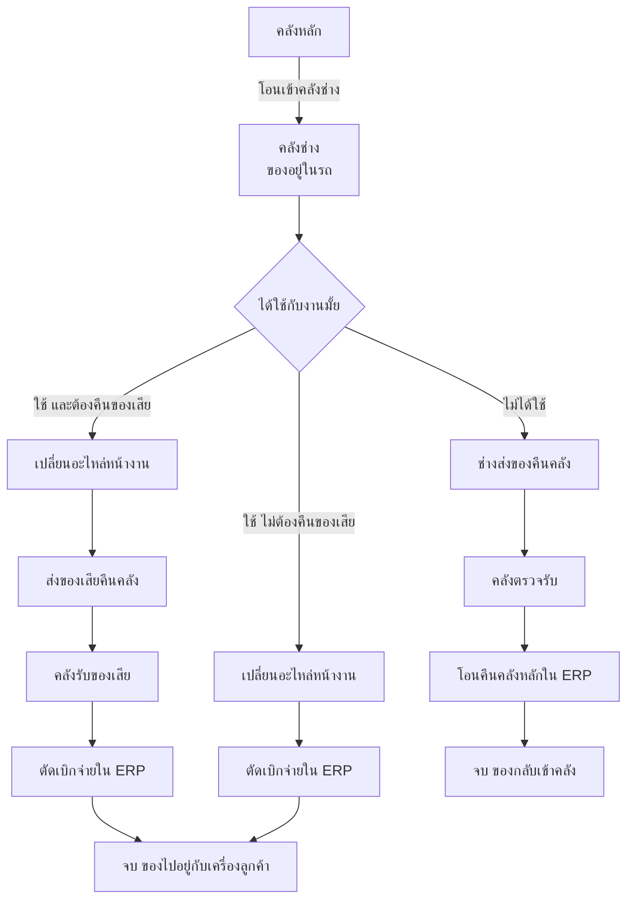
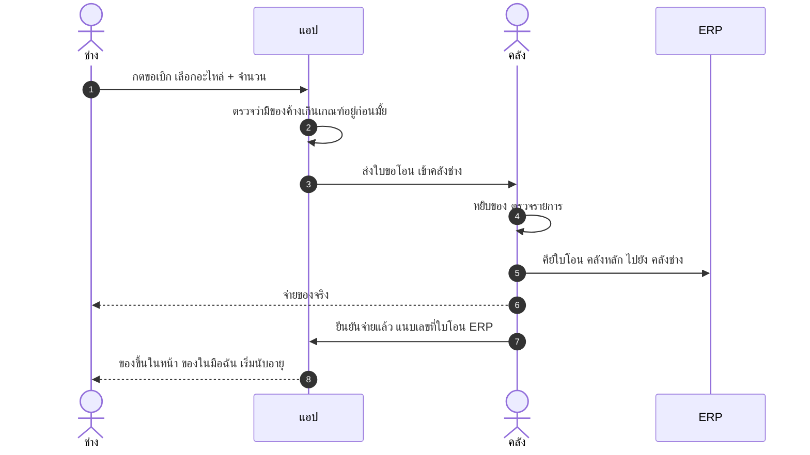
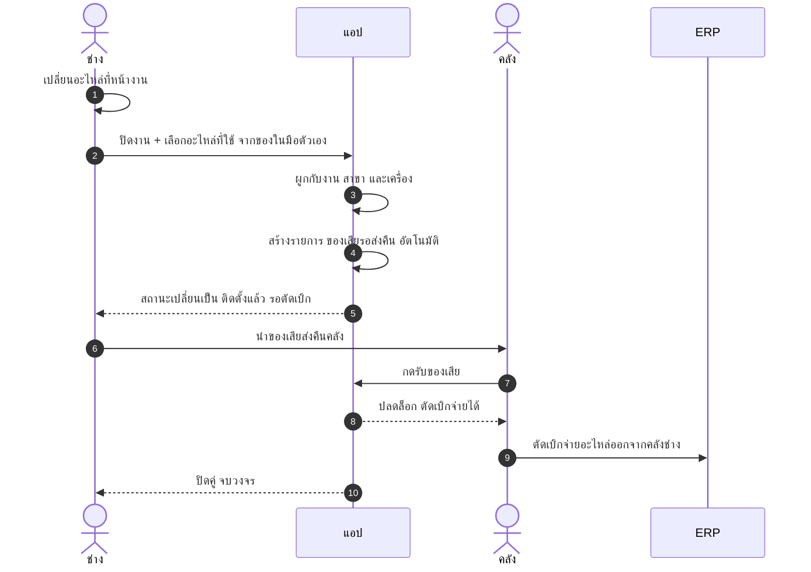
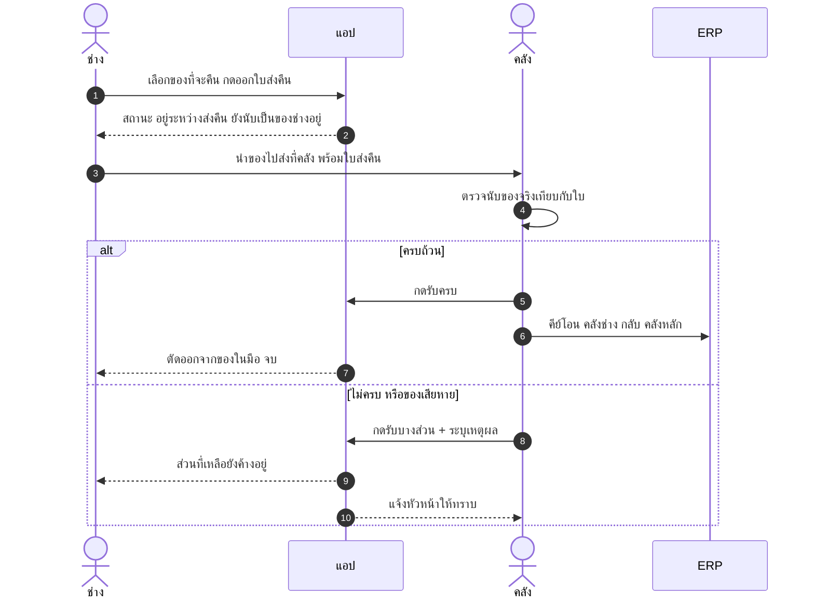
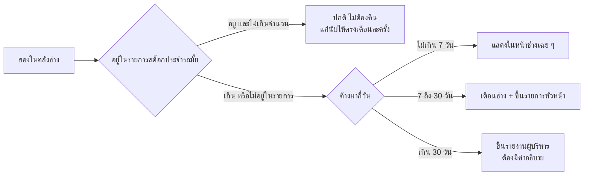

# วิธีการทำงาน — ระบบอะไหล่ผ่านคลังช่าง

เอกสารนี้อธิบาย **วิธีทำงานจริง** สำหรับใช้อธิบายทีมและใช้ฝึกคนใหม่
ส่วนเหตุผลเบื้องหลังการออกแบบอยู่ใน [แบบร่างกระบวนการ](./spare-part-custody-design.md)

---

## 1. ภาพรวมใน 1 นาที

อะไหล่ทุกชิ้นที่ออกจากคลังหลัก **ต้องไปลงที่คลังของช่างคนใดคนหนึ่งเสมอ** ห้ามหายไปเฉย ๆ
จากนั้นมีทางออกได้แค่ 3 ทาง

**หัวใจ:** ตราบใดที่ของยังไม่เดินไปถึงกล่อง "จบ" ของชิ้นนั้น**ยังเป็นความรับผิดชอบของช่าง**
และระบบจะนับอายุขึ้นเรื่อย ๆ ตั้งแต่วันที่โอนเข้าคลังช่าง

---

## 2. ใครทำอะไร

| ตัวละคร | หน้าที่ | ใช้เครื่องมืออะไร |
|---|---|---|
| **ช่าง** | ขอเบิก · บันทึกว่าใช้อะไหล่อะไรกับงานไหน · ส่งคืนของ | แอปบนมือถือ |
| **คลัง** | จ่ายของจริง · ตรวจรับของคืน · คีย์เอกสารเข้า ERP | ERP + แอป |
| **หัวหน้า** | อนุมัติกรณีของหาย/เสียหาย · ดูรายการของค้าง | แอป |
| **แอป** | เก็บ**สถานะ** · แสดงของในมือช่าง · นับอายุ · เตือน | — |
| **ERP** | เก็บ**ยอดคงเหลือ** ทุกคลัง รวมคลังช่าง | — |

> **จำง่าย ๆ: ERP เก็บยอด — แอปเก็บสถานะ**
> ยอดคงเหลือมีที่เดียวคือ ERP แอปไม่เคยเป็นเจ้าของตัวเลข

---

## 3. ขั้นตอนที่ 1 — เบิกอะไหล่เข้าคลังช่าง

**สิ่งที่ต้องเกิดขึ้นพร้อมกัน 3 อย่าง** — ขาดข้อใดข้อหนึ่ง วงจรจะเริ่มพัง

1. ของจริงถึงมือช่าง
2. ERP บันทึกโอนเข้าคลังช่าง
3. แอปรู้ว่าเริ่มนับอายุแล้ว

> **ถ้ามีของค้างเกินเกณฑ์:** ระบบ**ไม่บล็อก**การเบิก แต่แจ้งเตือนหัวหน้าให้ทราบ
> เพราะงานหน้าไซต์หยุดแพงกว่าอะไหล่ที่ค้างมาก ให้หัวหน้าเป็นคนตัดสินใจ

---

## 4. ขั้นตอนที่ 2 — เปลี่ยนอะไหล่หน้างาน

นี่คือขั้นที่สำคัญที่สุด เพราะเป็น**เวลาเดียวที่ช่างยังจำได้ว่าเกิดอะไรขึ้น**

### ⚠ จุดที่ต้องเข้าใจให้ตรงกันทั้งบริษัท

ระหว่างขั้นที่ 5 ถึง 9 จะเกิดช่วงเวลาที่

- ของใหม่ **ติดตั้งอยู่ในเครื่องลูกค้าแล้ว**
- แต่ **ERP ยังแสดงว่าของอยู่ในคลังช่าง** เพราะยังไม่ได้ตัดเบิก

**นี่ไม่ใช่ความผิดพลาด** เป็นผลจากกติกาที่ตั้งใจว่าต้องได้ของเสียคืนก่อนถึงตัดเบิก
เพื่อให้เรื่องเคลมประกันชัดเจน

แต่แปลว่า **ห้ามอ่านรายงานสต็อก ERP แล้วสรุปว่าของอยู่ในรถช่าง** ต้องดูสถานะในแอปประกอบเสมอ
แอปจะแสดงแยกให้ชัดว่าอันไหน "อยู่ในรถจริง" อันไหน "ติดตั้งแล้ว รอตัดเบิก"

> **ถ้าเป็นอะไหล่ที่ไม่ต้องคืนของเสีย** ให้ข้ามขั้น 6-8 ไปตัดเบิกจ่ายได้เลยตอนปิดงาน

---

## 5. ขั้นตอนที่ 3 — คืนของที่ไม่ได้ใช้

### 🔑 กฎเหล็กข้อเดียวของขั้นนี้

> **ยอดจะลดก็ต่อเมื่อคนคลังกดรับแล้วเท่านั้น**

ถ้าช่างกด "คืนแล้ว" ได้เองคนเดียว ตัวเลขทั้งระบบจะกลายเป็นนิยายภายในเดือนเดียว
ช่วงที่ของอยู่ระหว่างทาง ระบบต้องเห็นว่า "อยู่ระหว่างส่งคืน" ไม่ใช่หายไปจากบัญชีช่าง

---

## 6. ตารางสรุป — ทำที่ไหน บันทึกที่ไหน

| เหตุการณ์ | ของจริง | บันทึกใน ERP | บันทึกในแอป |
|---|---|---|---|
| ช่างขอเบิก | — | — | ✅ ใบขอโอน |
| คลังจ่ายของ | คลัง → ช่าง | ✅ โอนเข้าคลังช่าง | ✅ เริ่มนับอายุ |
| เปลี่ยนอะไหล่หน้างาน | ช่าง → เครื่องลูกค้า | ❌ ยังไม่บันทึก | ✅ ผูกงาน + สร้างคู่ของเสีย |
| ส่งของเสียคืน | ช่าง → คลัง | — | ✅ รอคลังรับ |
| คลังรับของเสีย | — | — | ✅ ปลดล็อกตัดเบิก |
| ตัดเบิกจ่าย | — | ✅ ตัดออกจากคลังช่าง | ✅ ปิดคู่ |
| ส่งของที่ไม่ได้ใช้คืน | ช่าง → คลัง | — | ✅ รอคลังรับ |
| คลังรับของคืน | — | ✅ โอนกลับคลังหลัก | ✅ ตัดออกจากของในมือ |
| นับสต็อกรถ | — | ✅ ปรับปรุงยอด | ✅ ใบนับ + อนุมัติ |

**อ่านตารางนี้ยังไง:** ทุกแถวที่ ERP ไม่มีเครื่องหมาย คือช่วงที่ **ERP ไม่รู้ว่าเกิดอะไรขึ้น**
ซึ่งก็คือเหตุผลทั้งหมดที่ต้องมีแอป

---

## 7. สถานะและความหมาย

| สถานะในแอป | แปลว่า | ERP แสดงเป็น | นับอายุมั้ย |
|---|---|---|---|
| **อยู่ในรถ** | ของอยู่กับช่าง ยังไม่ได้ใช้ | คลังช่าง | ✅ นับ |
| **ติดตั้งแล้ว รอตัดเบิก** | ใช้ไปแล้ว รอของเสียกลับ | คลังช่าง ⚠ | ✅ นับ |
| **ของเสียรอส่งคืน** | ของเสียยังอยู่กับช่าง | ไม่เห็น | ✅ นับ |
| **อยู่ระหว่างส่งคืน** | ช่างส่งแล้ว คลังยังไม่กดรับ | คลังช่าง | ✅ นับ |
| **คืนแล้ว** | คลังรับเรียบร้อย | คลังหลัก | ❌ จบ |
| **ตัดเบิกแล้ว** | จบวงจร ของอยู่กับเครื่องลูกค้า | ตัดออกแล้ว | ❌ จบ |
| **รออนุมัติปรับปรุง** | ของหาย/เสียหาย รอหัวหน้า | คลังช่าง | ✅ นับ |

---

## 8. กรณีพิเศษ

### ส่งต่อระหว่างช่าง

เกิดขึ้นจริงตลอดเวลา — *"พี่มีวาล์วมั้ย ขอตัวนึง"* **ต้องทำในระบบ** ไม่งั้นยอดจะเพี้ยนทันที

ช่าง ก. กดส่งต่อ → ช่าง ข. กดรับ → คลังคีย์โอนคลังช่าง ก. ไปคลังช่าง ข. ใน ERP
ต้องยืนยันสองฝ่ายเหมือนการคืนของ

### ของหาย หรือเสียหาย

ช่างแจ้ง → หัวหน้าอนุมัติ → คลังคีย์ปรับปรุงยอดใน ERP
**ห้ามให้ช่างปรับยอดเองโดยไม่มีคนอนุมัติ** ไม่งั้นทุกปัญหาจะถูกกลบด้วยการปรับยอด

### นับสต็อกรถ เดือนละครั้ง

ช่างเปิดรายการของในมือ → นับของจริงในรถ → กรอกยอดที่นับได้
ส่วนต่างเข้ากระบวนการอนุมัติ → คลังคีย์ปรับปรุงยอด

ต่อให้ออกแบบดีแค่ไหน ยอดจะเพี้ยนตามเวลาเสมอ ข้อนี้คือจังหวะรีเซ็ตความจริง

### ช่างลาออก หรือย้ายทีม

**ปิดคลังช่างได้ต่อเมื่อยอดเป็นศูนย์เท่านั้น** ต้องเคลียร์ให้จบก่อนคืนรถ คืนบัตรพนักงาน

---

## 9. สต็อกประจำรถ — ของแบบไหนไม่ต้องคืน

ไม่ใช่ของค้างทุกชิ้นที่เป็นปัญหา อะไหล่บางตัวควรอยู่ติดรถถาวรเพื่อให้ช่างซ่อมจบในเที่ยวเดียว

| อะไหล่ | ให้ติดรถได้ |
|---|---|
| วาล์วน้ำ 4 ทาง Oasis | 2 ตัว |
| ELECTRODE, SPARK PKG | 3 ตัว |
| คอยล์มิเตอร์ตัวรับเหรียญ | 1 ตัว |

**เหตุผล:** ช่างเบิกเผื่อเพราะการเบิกมันช้า ถ้าไปงานแล้วไม่มีของต้องกลับมาเบิกใหม่ เสียทั้งวัน
ถ้าตั้งกติกาว่าของค้างคือความผิดทั้งหมด ผลที่ได้จะไม่ใช่ช่างคืนของ แต่จะเป็น**ช่างซ่อนของ**
ซึ่งแย่กว่าเดิม — ระบบจึงไล่ตามเฉพาะส่วนที่เกินเกณฑ์

---

## 10. สิ่งที่ช่างต้องทำ — สรุปสั้นที่สุด

ถ้าจะบอกช่างแค่ 4 ข้อ ให้บอก 4 ข้อนี้

1. **รับของ** → เช็กว่าขึ้นในแอปครบมั้ย
2. **ใช้ของ** → ปิดงานในแอปทุกครั้ง เลือกอะไหล่ที่ใช้
3. **ของเสีย** → ส่งคืนคลังให้เร็วที่สุด ไม่งั้นตัดเบิกไม่ได้
4. **ไม่ได้ใช้** → กดคืนในแอปแล้วเอาของไปส่ง อย่าเก็บไว้เฉย ๆ

และข้อที่ทำให้ทุกอย่างง่ายขึ้น: **เปิดหน้า "ของในมือฉัน" ดูสัปดาห์ละครั้ง**
